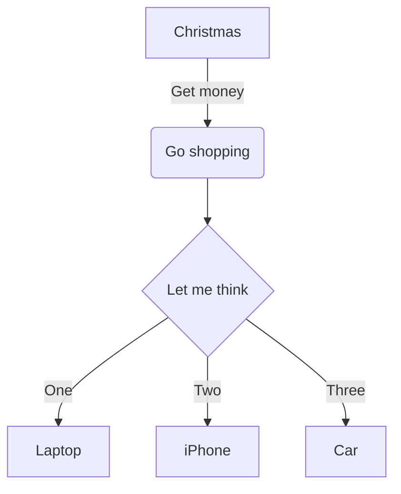

<button type="button" onClick="navigator.clipboard.writeText('mkdocs new mkdocs_demo')">mkdocs new mkdocs_demo</button>

<button type="button" onClick="navigator.clipboard.writeText('mkdocs serve')">mkdocs serve</button>

add files

````md

````

search plugin [https://github.com/mkdocs/catalog](https://github.com/mkdocs/catalog)

add theme [https://pawamoy.github.io/mkdocs-gallery/](https://pawamoy.github.io/mkdocs-gallery/)

create repository [https://github.com/new](https://github.com/new)

<button type="button" onClick="navigator.clipboard.writeText('git remote add origin git@github.com:clovehitch5/mkdocs_demo.git')">git remote add origin git@github.com:clovehitch5/mkdocs_demo.git</button>

<button type="button" onClick="navigator.clipboard.writeText('git init')">git init</button>

<button type="button" onClick="navigator.clipboard.writeText('git commit -am "initial commit"')">git commit -am "initial commit"</button>

<button type="button" onClick="navigator.clipboard.writeText('mkdocs gh-pages')">mkdocs gh-pages</button>
