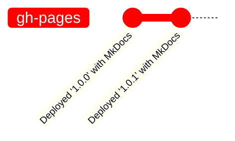

# Deployment

## GitHub Pages

```bash
mkdocs gh-deploy --clean
```


```mermaid
gitGraph LR:
    commit id: "1.0.0"
    commit id: "1.0.1"
```


```mermaid
---
config:

    theme: 'default'
    themeVariables:
        'git0': '#ff0000'
    gitGraph:
        mainBranchName: "gh-pages"

---
gitGraph LR:
    commit id: "Deployed '1.0.0' with MkDocs"
    commit id: "Deployed '1.0.1' with MkDocs"
```
